# Azure Modern Hub-Spoke Architecture

> Enterprise-grade Microsoft Azure architecture demonstrating Hub-Spoke networking, centralized security, multi-spoke segmentation, and modern application delivery using Azure Front Door and WAF.

---

# 📌 Overview

This project implements a modern multi-spoke Hub-Spoke architecture in Microsoft Azure, following enterprise design patterns.

The environment simulates a secure, scalable, and production-ready cloud architecture with:

- Centralized security (Hub)
- Multiple isolated workloads (Spokes)
- Cloud-native application deployment (PaaS)
- Secure global application publishing

---

# 🏗️ Architecture Overview

## 🔹 Resource Groups

| Resource Group | Purpose |
|---|---|
| HEVNetRG1 | Hub Infrastructure (Shared Services & Security) |
| HEVNetRG2 | Production Application (WordPress + Database) |
| HEVNetRG3 | Development Environment |

---

# 🌐 Hub-Spoke Topology

## 🧭 Hub Network (HEVNet1)

Address space: 10.7.0.0/20

### Subnets

| Subnet | Purpose |
|---|---|
| Management | Administrative resources |
| AzureFirewallSubnet | Azure Firewall |
| AzureFirewallManagementSubnet | Firewall management |
| AzureBastionSubnet | Secure access |

---

## 🚀 Spoke - Application (Production)

This spoke hosts a modern cloud-native application.

### Components

- Azure App Service (WordPress)
- Azure Database for MySQL Flexible Server
- Azure Front Door
- Web Application Firewall (WAF)
- NSG and Route Tables

### Why PaaS?

- No VM management
- Built-in scalability
- Lower operational overhead

---

## 🧪 Spoke - Development

This spoke represents a non-production environment.

### Components

- Virtual Machine (HEVM3)
- Dedicated VNet
- NSG
- Route Tables

---

# 🔐 Security Architecture

## Azure Firewall

Central security layer responsible for:

- Traffic inspection
- Network rules
- Outbound control
- Forced routing

---

## Web Application Firewall (WAF)

- Protection against OWASP Top 10
- Layer 7 filtering
- Integrated with Front Door

---

## Network Security Groups (NSG)

- Traffic segmentation
- Controlled access between tiers
- Default deny model

---

## Azure Bastion

- Secure SSH/RDP access
- No public IP exposure
- Browser-based connection

---

# 🌍 Connectivity

## VNet Peering

- Hub ↔ Spoke-App
- Hub ↔ Spoke-Dev

Benefits:

- Private communication
- Low latency
- High performance

---

# 🧭 Routing Strategy

## User Defined Routes (UDR)

All traffic is routed through Azure Firewall:

0.0.0.0/0 → Azure Firewall

Purpose:

- Centralized inspection
- Traffic visibility
- Security enforcement

---

# 🌐 Application Delivery

## Azure Front Door (Premium)

- Global entry point
- Load balancing
- SSL offload
- WAF integration

---

# 🖥️ Application Architecture

## WordPress (App Service)

- Fully managed PaaS
- High availability
- Auto scaling

---

## Database Layer

### Azure Database for MySQL Flexible Server

- Managed database
- Automated backups
- High availability

---

# 🚦 End-to-End Traffic Flow

Internet  
↓  
Azure Front Door  
↓  
Web Application Firewall (WAF)  
↓  
Azure Firewall  
↓  
App Service (WordPress)  
↓  
MySQL Flexible Server  

---

# 📸 Architecture Evidence

## Resource Groups
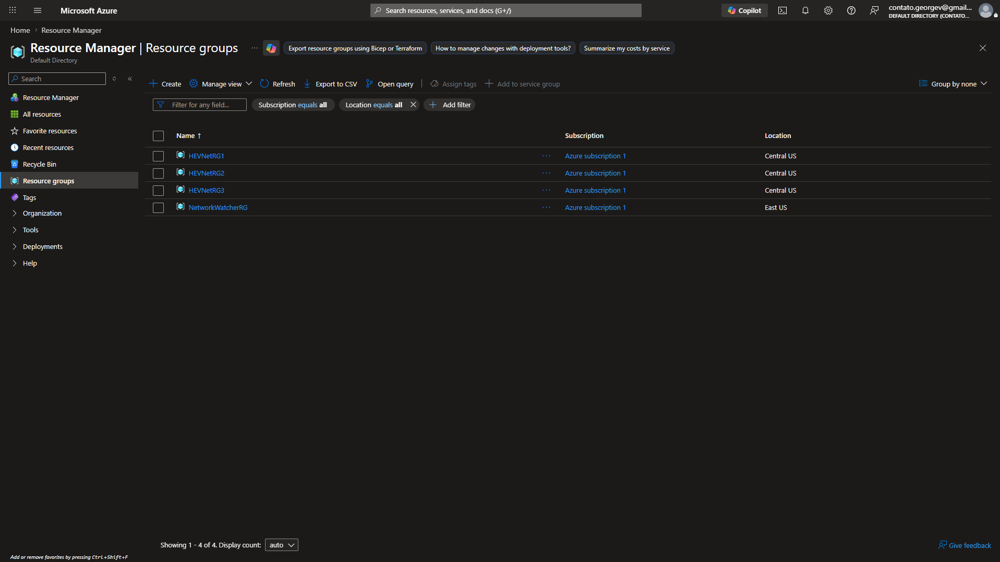

---

## Hub Network
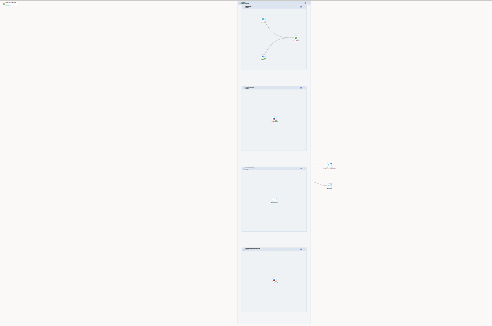

---

## Spoke - Application
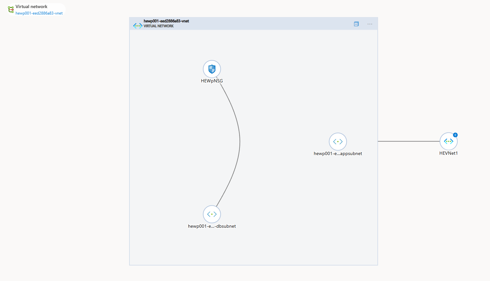

---

## Spoke - Development
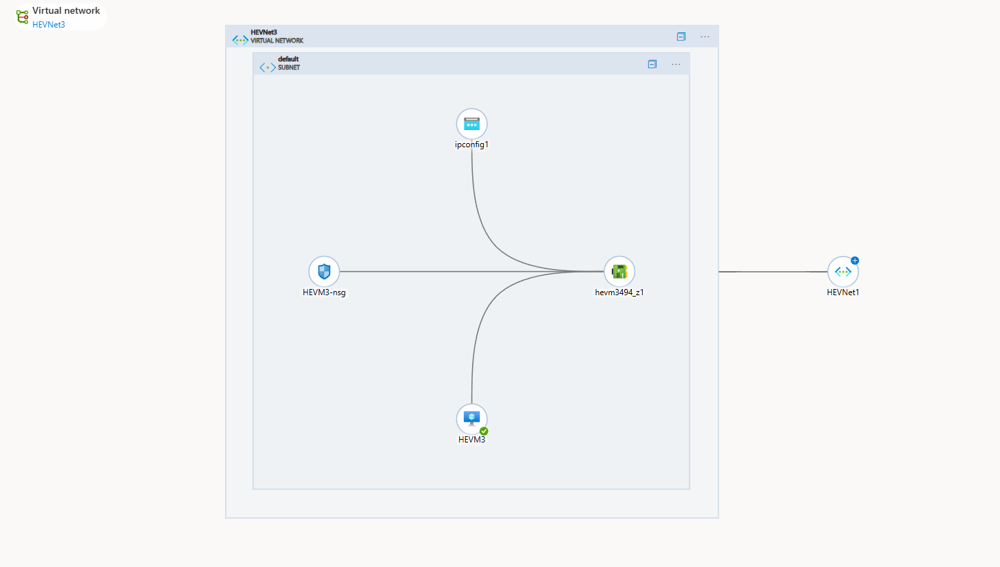

---

## VNet Peering
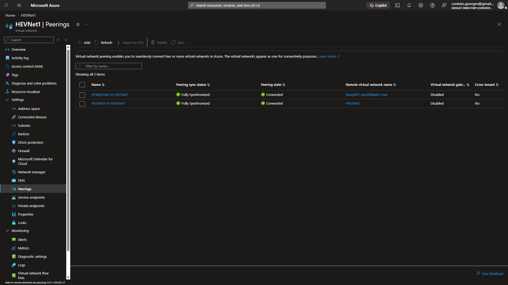

---

## Azure Firewall
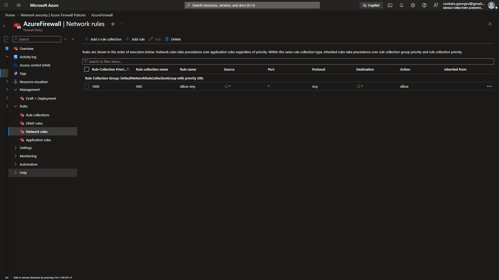

---

## Routing - App
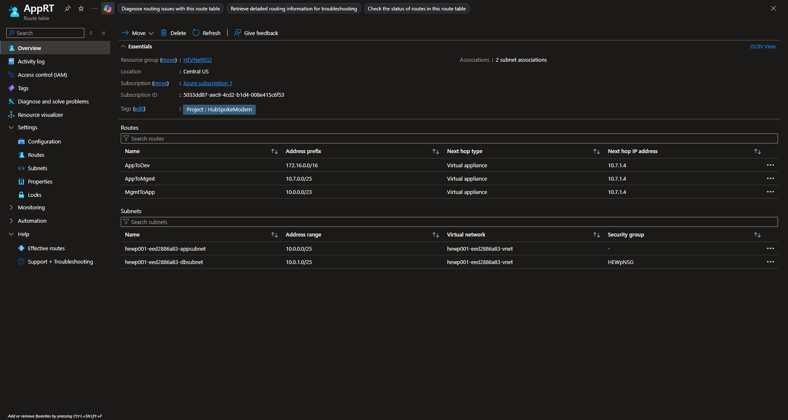

---

## Routing - Dev
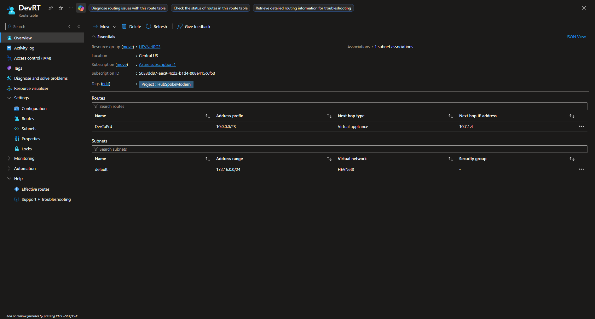

---

## Azure Front Door
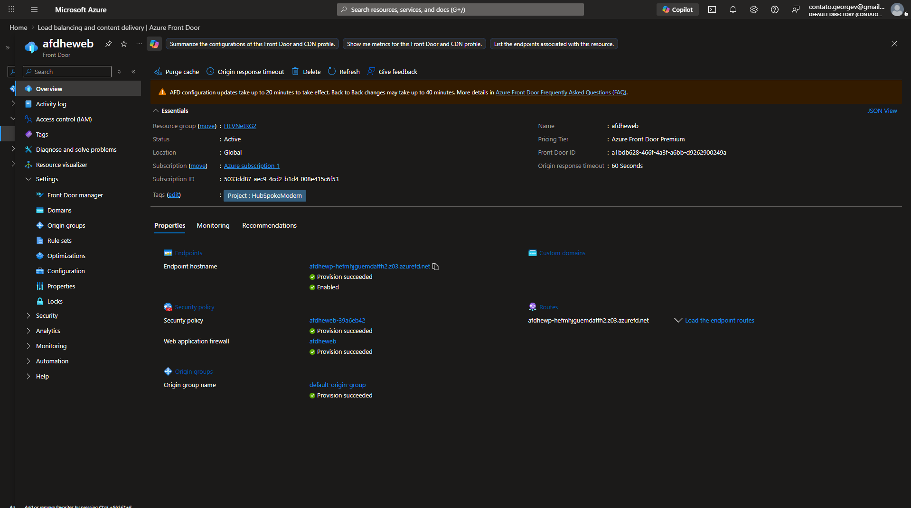

---

## Web Application Firewall
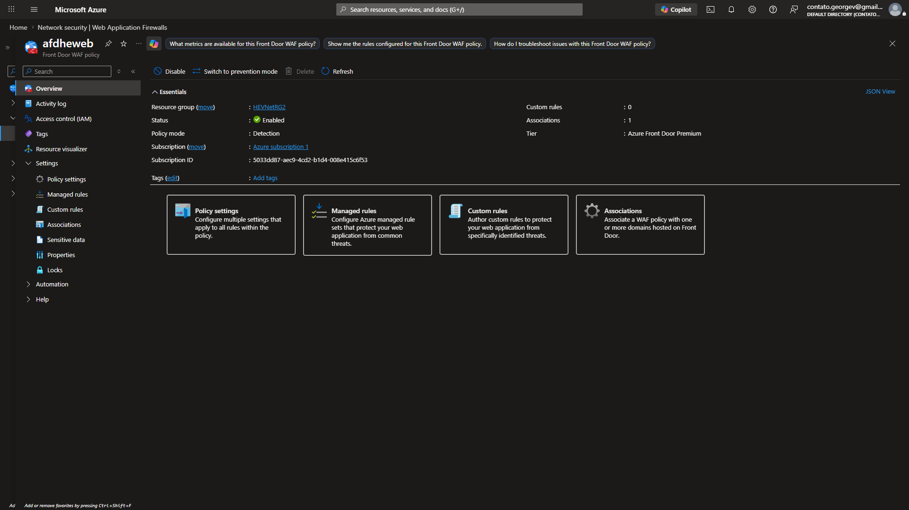

---

## Azure Bastion
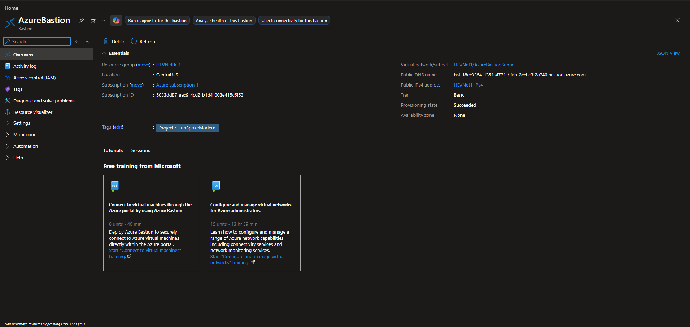

---

## Application Running
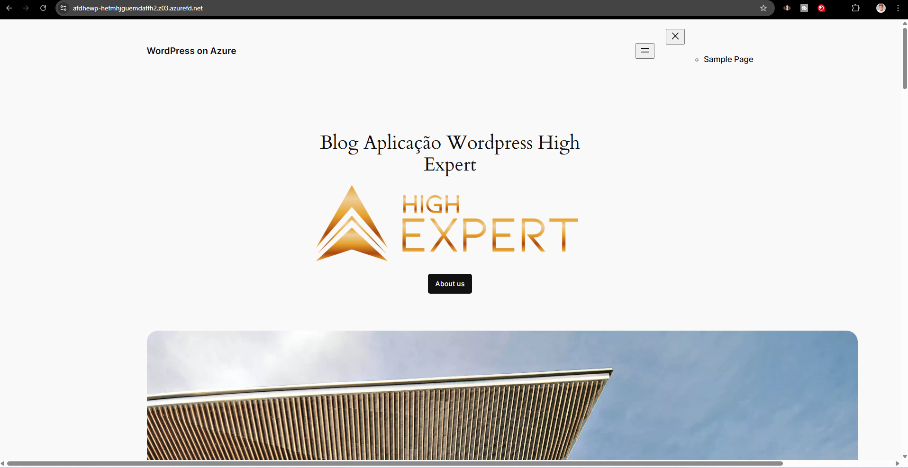

---

# 📚 Concepts Practiced

- Hub-Spoke Architecture  
- Multi-Spoke Design  
- Azure Networking  
- Azure Firewall  
- Web Application Firewall  
- Azure Front Door  
- NSG  
- Route Tables (UDR)  
- VNet Peering  
- Azure Bastion  
- PaaS Architecture  

---

# 💰 FinOps Considerations

Key cost drivers:

- Azure Firewall  
- Front Door (requests + data transfer)  
- WAF Policy  
- Bastion  
- MySQL Flexible Server  
- App Service Plan  
- VNet Peering traffic  

---

# 🎯 Learning Objectives

- Design enterprise Azure architecture  
- Implement Hub-Spoke networking  
- Apply centralized security  
- Deploy modern applications  
- Prepare for AZ-305  

---

# 🛠️ Technologies Used

- Microsoft Azure  
- Azure Virtual Network  
- Azure Firewall  
- Azure Bastion  
- Azure Front Door  
- Web Application Firewall  
- Azure App Service  
- Azure Database for MySQL  
- NSG  
- Route Tables  

---

# 👨‍💻 Author

Project developed for:

- Azure Architecture  
- Cloud Engineering  
- Security  
- FinOps  
- AZ-305 Preparation  

---

# ⭐ Key Takeaways

- Hub-Spoke architecture scales efficiently  
- Centralized security improves governance  
- PaaS reduces operational complexity  
- Front Door + WAF enables secure global access  
